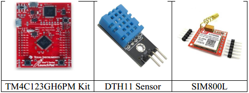
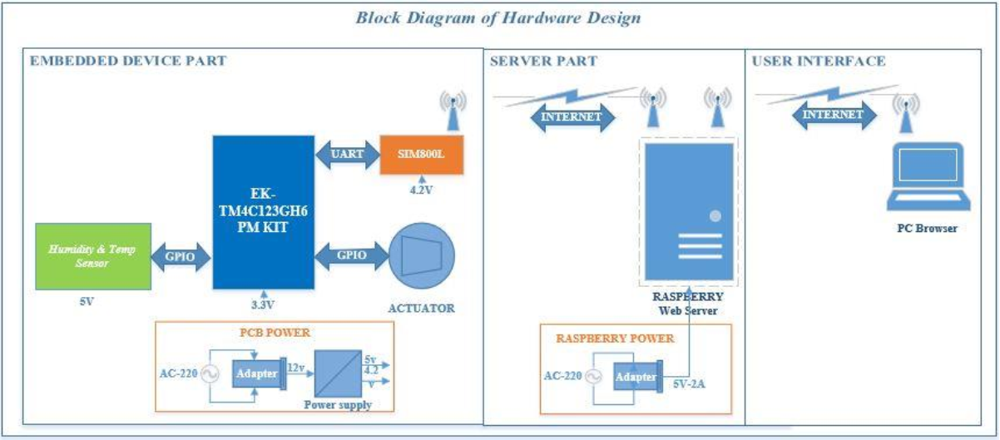
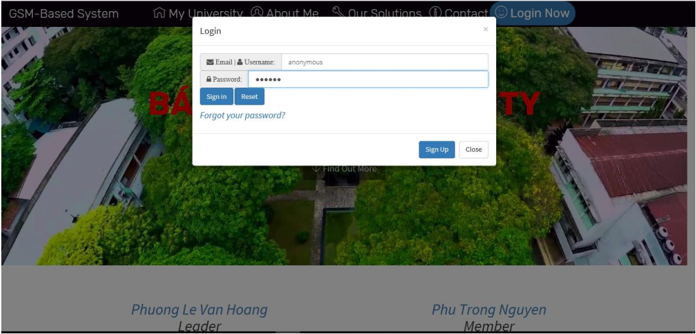
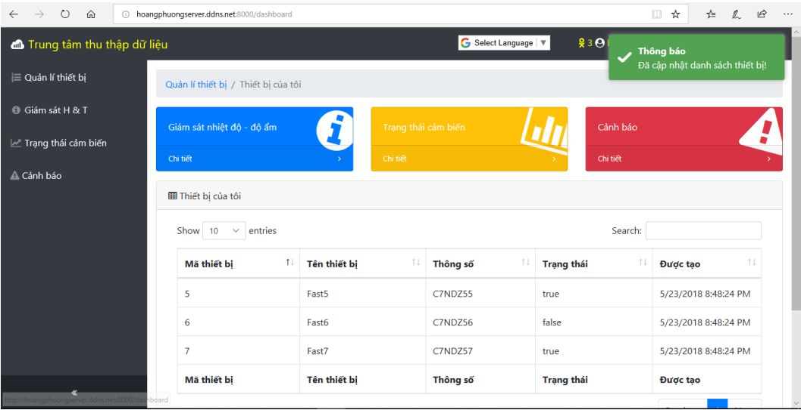
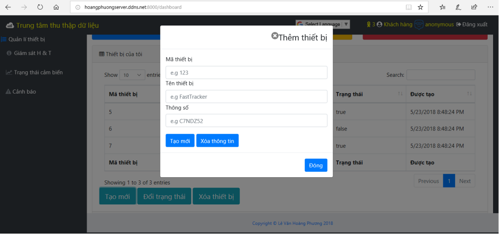
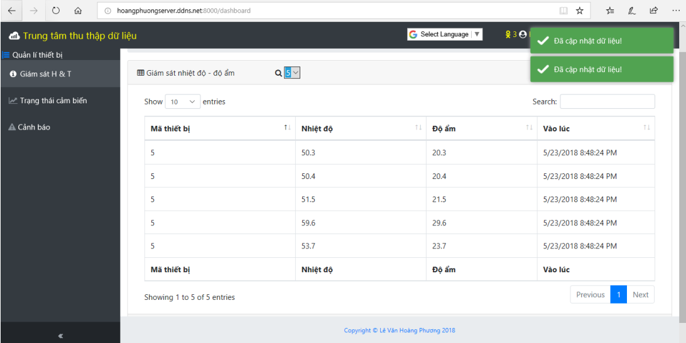
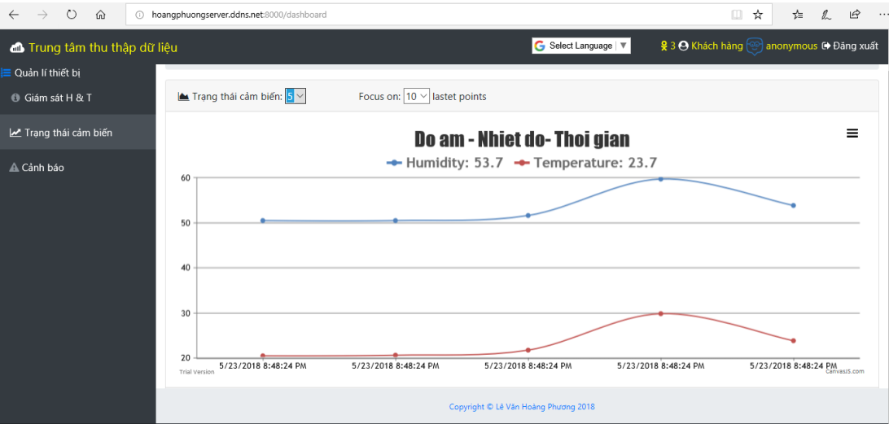
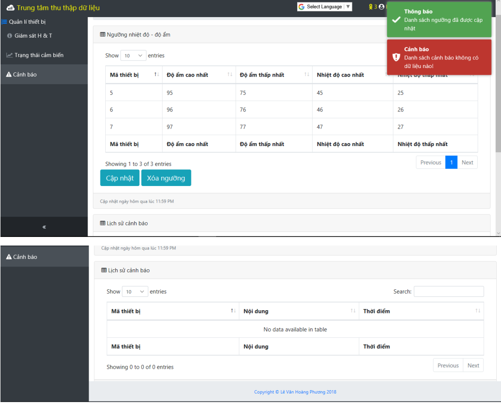
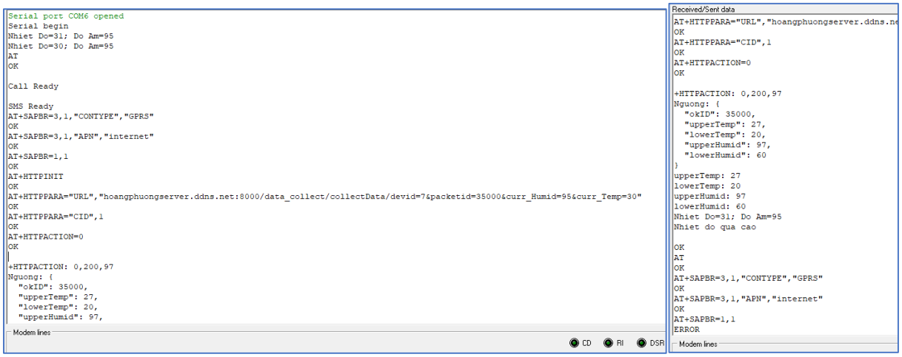

# GSM-based Humidity and Temperature Monitoring System(BHPS)
**Keywords: GSM, Web server, SailsJS, Tiva, DHT11** 

# Introduction
This project is my course's project at University of Technology. I am going to build a system powered by a web server that helps people monitor the humidity and temperature of their house, garden, etc via a web browser over the Internet. Data are transfered from sensors to the server via GPRS/2G.


Table of contents
=================
- [I.Description](#idescription)
- [II.Prerequisites](#iiprerequisites)
- [III. Deployment](iiideployment)
  * [III.1.Web server](#iii1web-server)
  * [III.2.TivaC](#iii2tivac)
- [IV.System model](#ivsystem-model)
- [V.Some results](#vsome-results)

I. Description
==============
This project is made up of a web server, an embedded device
- Web server: powered by SailsJS, AngularJS implementation on front-end.
- Embedded Device: TivaC129, DHT11 sensor, SIM800L module

II. Prerequisites
==============
* OS to run web server: I am using Ubuntu 17.10.
* Nodejs: 
```
Install: sudo apt-get install nodejs -y && sudo apt-get install npm -y

Update npm: sudo npm install npm@latest
```
* Install SailsJS: [here](https://sailsjs.com/get-started) or
```
sudo npm install sails --g
```
* MySQL: 
```
sudo apt-get install mysql-server mysql-client -y
```
* Apache2
```
sudo apt-get install apache2 -y
```

III. Deployment
==============
III.1 Web server
----
```
1. Open terminal
2. cd 'Web Server' 
3. npm install
4. config MySQL server: username, password, hostname in config/local.js
5. sails lift
```
III.2 TivaC
----
<p align="center">
  
</p>

```
1. Import project in Code Composer Studio (CCS) of Texas Instruments. 
2. Power on Kit and compile the project
```

IV. System model
==============
<p align="center">
  
</p>


V. Some results
==============
<p align="center">
  
  
  
  
  
  
</p>

<p align="center">
  
</p>